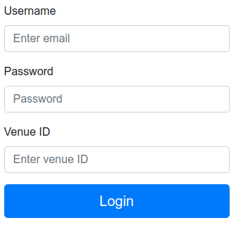
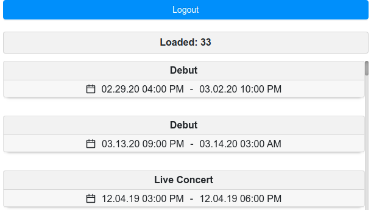

# Infinite-loader

## This is a test app that uses https://bvaughn.github.io/react-virtualized/#/components/InfiniteLoader to implement an infinite list.

### Login Form

### List

## To start the application, run the following commands:
### `npm i`
### `npm start`

Runs the app in the development mode. 
Open [http://localhost:3000](http://localhost:3000) to view it in the browser.
